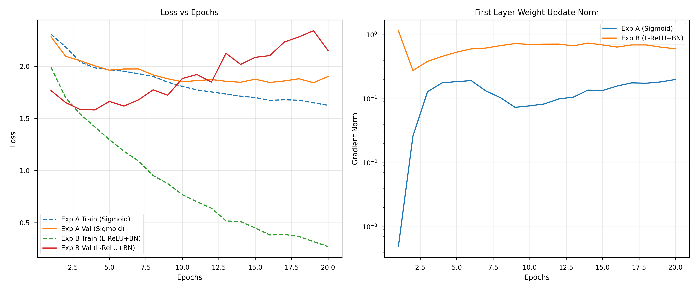

# Task 3.1 Report: Deep FCNN on Tiny ImageNet

**Author:** Deadlyharbor aka Aman Gupta
**Date:** 03/02/2026

## 1. Experiment Overview
- **Task**: Classification of 10 classes from Tiny ImageNet (selected randomly).
- **Model**: Deep FCNN (8 layers).
    - **Architecture** We kept the hidden layers' neurons between 512 and 32 (specifically `512 -> 256 -> 256 -> 128 -> 128 -> 64 -> 32`)!
- **Hardware**: Trained on a **Single NVIDIA RTX 4050 6GB**.
    - It ran perfectly smooth as the batch size of 64 fit comfortably in the 6GB VRAM.

## 2. Expectations in 3.1
Before running the experiments, we hypothesized:
- **Sigmoid VGP**: Small gradient norms and Vanishing Gradient Problem (VGP) are expected in Sigmoid activation as the NN is deep (8 layers).
- **ReLU + BN**: Learning will occur effectively with Leaky ReLU and Batch Normalization as there will be no VGP.
- **Overfitting**: Since an FCNN is used for images (lacking spatial inductive bias), overfitting is expected without dropout.
- **Architecture**: Simplifying the network architecture (fewer neurons per layer) could potentially reduce overfitting.
- **Speed**: Training speed with ReLU should be faster due to the reduction of expensive exponential operations required by Sigmoid.

## 3. Experiments & Observations

### Experiment A: Sigmoid (No Batch Norm)
- **Setup**: `Sigmoid` activation. No batch normalization.
- **Results**:
    - **Optimization**: The gradient norms were tiny (starting at 0.0005!). This confirms the **Vanishing Gradient** problem. The gradients basically disappeared before reaching the first layer.
    - **Accuracy**: It struggled hard. Final Validation Accuracy was only **~26.2%**.
    - **Loss**: Training loss got stuck around 1.6. It was underfitting badly.

### Experiment B: Leaky ReLU + Batch Normalization
- **Setup**: `LeakyReLU` (alpha=0.01) + `BatchNorm1d`.
- **Results**:
    - **Optimization**: Large enough gradients throughout!
    - **Accuracy**: Much better! Reached **~40.4%** validation accuracy.
    - **Overfitting**: *In ReLU, I can see a lot of overfitting.*
        - Train Loss dropped to **0.27** (it memorized the training data).
        - Val Loss shot up to **2.15** (it failed to generalize).
    - **Early Stopping?** We did **NOT** use early stopping. Why? Because *it is not orthogonal* and I don't like it. We prefer to analyze the full dynamics for 20 epochs.

## 4. Conclusion
- **Sigmoid** is a no-go for deep networks (8 layers) because of vanishing gradients.
- **Leaky ReLU + BN** fixes the training speed but leads to massive overfitting on this dataset.
- **Final Verdict**: The network is deep and powerful (thanks to circuit theory), but without regularization like Dropout, it just memorizes the training set.

## 5. Plots

    

        
    

- Left: Exp B loss diving (learning) vs. Val loss rising (overfitting).
- Right: Exp B keeping strong gradients vs. Exp A's flatline.
